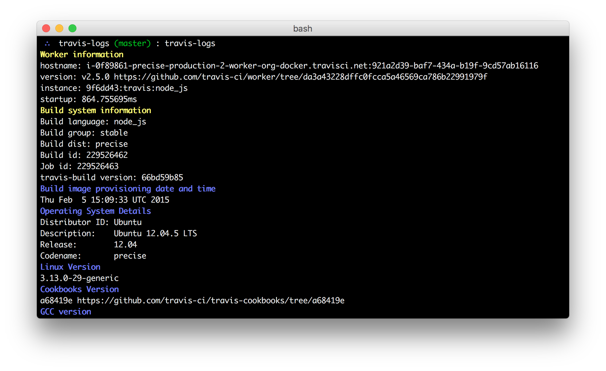
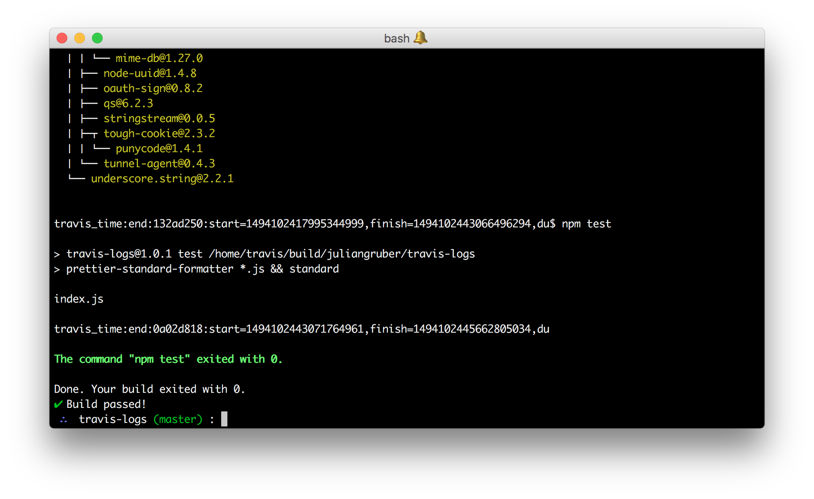

# travis-logs [](https://travis-ci.org/juliangruber/travis-logs)

Stream travis logs of the current repository's current commit to the terminal, until all jobs are finished!





## Usage

```bash
$ cd ~/dev/level/leveldown
$ travis-logs

$ # or

$ travis-logs ~/dev/level/leveldown
```

## Installation

```bash
$ npm install -g travis-logs
```

## License

MIT


